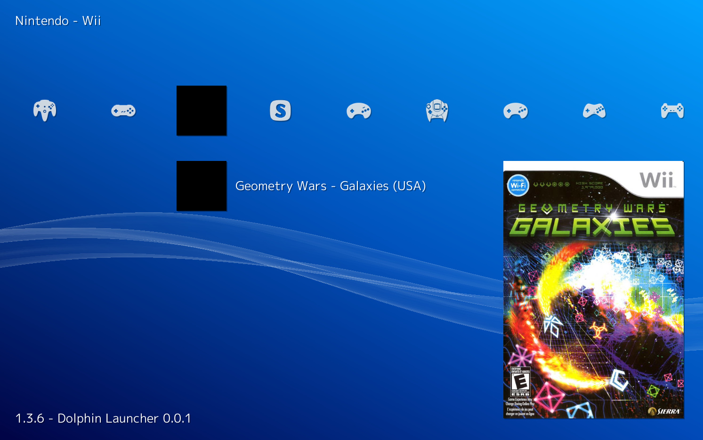

# libretro-dolphin-launcher

Launch [Dolphin](https://dolphin-emu.org) from [RetroArch](http://www.libretro.com/).



## Installation

1. Compile the core
  ``` bash
  git clone https://github.com/RobLoach/libretro-dolphin-launcher.git
  cd libretro-dolphin-launcher
  make
  ```

2. Copy the core file to the RetroArch cores directory
  ``` bash
  cp dolphin_launcher_libretro.so /usr/lib/libretro/
  ```

3. Make sure [Dolphin](http://dolphin-emu.org) is installed
  ``` bash
  apt-get install dolphin-emu
  ```

## Usage

1. Scan Nintendo GameCube and Wii in RetroArch

2. Launch the games directly from the RetroArch menu

3. Alternatively, you can run games through the command line
  ``` bash
  retroarch -L /usr/lib/libretro/dolphin_launcher_libretro.so Mario.gcm
  ```

## Credits

- [Rob Loach](http://github.com/robloach)
- [Alcaro](https://github.com/Alcaro)
