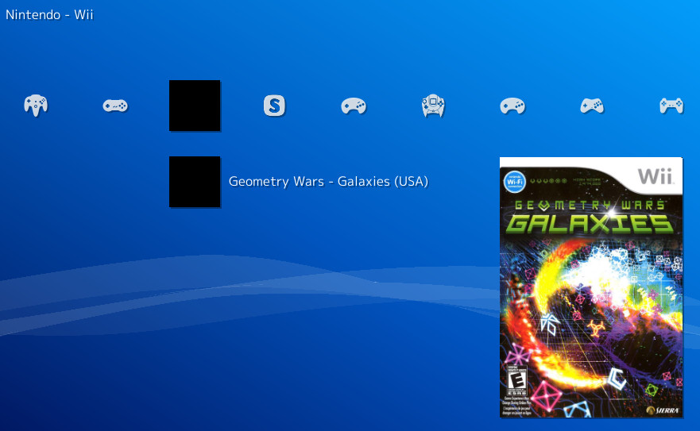

# libretro-dolphin-launcher

Launch Nintendo Wii and GameCube games through [Dolphin](https://dolphin-emu.org), directly from [RetroArch](http://www.libretro.com/).



## Installation

1. Compile the core
  ``` bash
  git clone https://github.com/RobLoach/libretro-dolphin-launcher.git
  cd libretro-dolphin-launcher
  make
  ```

2. Copy the core file to the RetroArch cores directory
  ``` bash
  cp dolphin_launcher_libretro.so /usr/lib/libretro/
  cp dolphin_launcher_libretro.info /usr/share/libretro/info/
  ```

3. Make sure [Dolphin](http://dolphin-emu.org) [is installed](https://dolphin-emu.org/download/?ref=btn). You should be able to run at least one of the following commands:
  ``` bash
  dolphin-emu --version
  dolphin-emu-nogui --version
  flatpak run org.DolphinEmu.dolphin-emu --version
  ```

## Usage

1. Scan Nintendo GameCube and Wii games in RetroArch

2. Launch the games directly from the RetroArch menu

3. Alternatively, you can run games through the command line
  ``` bash
  retroarch -L dolphin_launcher_libretro.so Mario.gcm
  ```

## Contributors

- [Rob Loach](http://github.com/robloach)
- [Alcaro](https://github.com/Alcaro)
